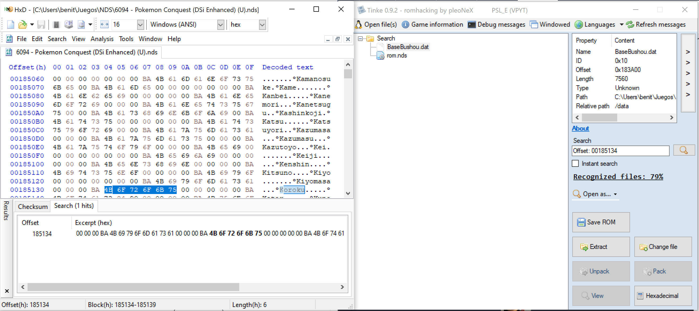
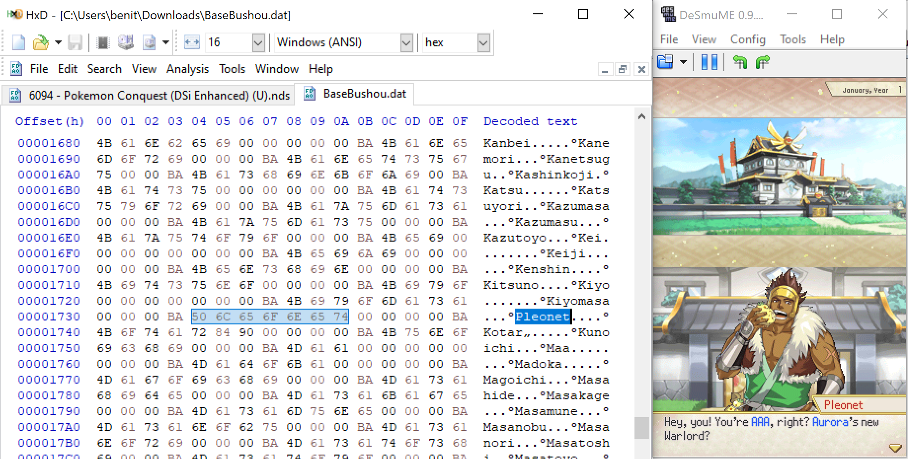
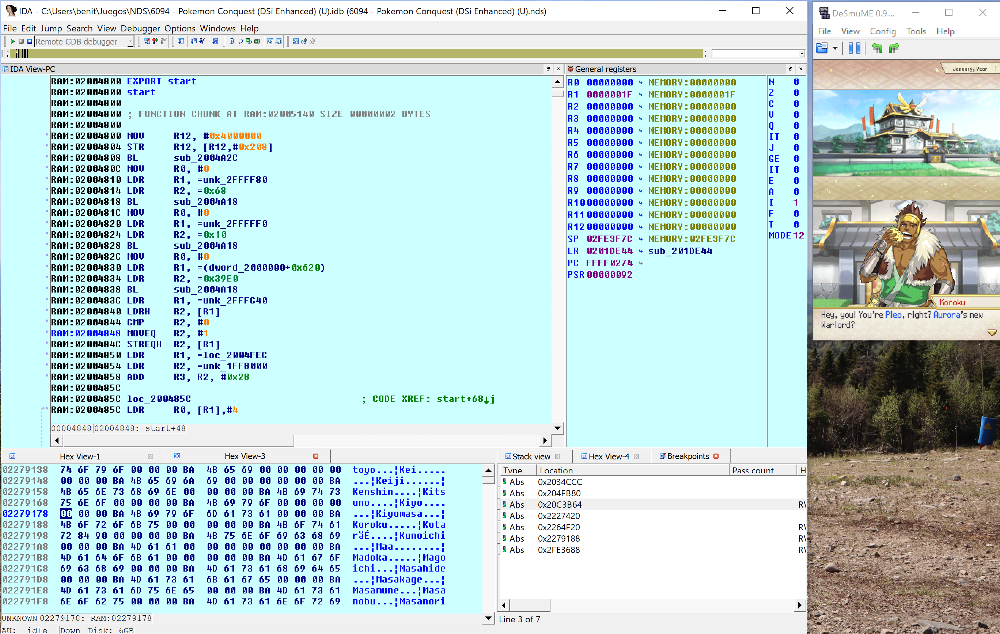
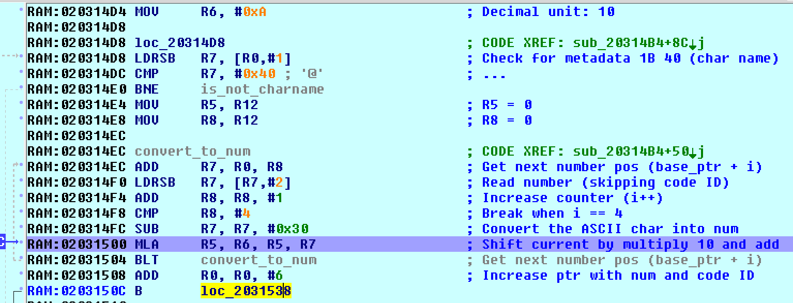
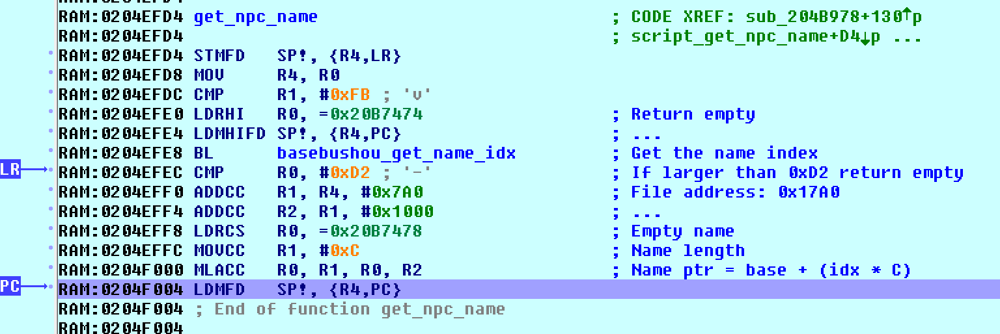

## Intro

Pokémon Conquest (NDS) is one of the games I would like to translate to Spanish. I have already created almost all the tools to extract, modify and insert the content. This time, I would like to focus in the story dialogs. Below is one example:

```plain
{char:0058}{speaker_color:2}{char_img:0}
Hey, you!{wait:48}20 You're {name1}, right? {color:49}Aurora{color:51}'s new
Warlord?
```

If you take a closer look you will notice we are missing something: __we don't know the name of the character speaking__. This is a very important information for translators, because otherwise they are out of context. For instance, they won't know the gender of the person speaking (in Spanish we have male and female version of nouns and adjetives).

So let's try to figure out where are the names and how we can relate them to each dialog.

## The location of the names

First, let's find out where are the names inside the game files. I will pick the name of the person speaking in the example dialog: `Koroku`. So let's open the game with an hexadecimal editor (I like [HxD](https://mh-nexus.de/en/hxd/)) and search the text. The search returns that the text is located at `0x00185134`. We just need to know which game file is at that address. The easier method is to use [Tinke](https://github.com/pleonex/tinke/). We open the game with this program and type in the search box the magic words: `Offset: 00185134`. It will show us at this address we have the file **`BaseBushou.dat`**.



We ran a quick test that this is indeed the file and field that we need to change by editing the name and importing back the file into the game.



Voila. As you can see I changed in the file the name `Koroku` with `Pleonet` and now the latter is showing as the character speaking.

## Matching the dialog with the name

We know the file that contain the list of names. This is useful in case we want to change them. But we don't know who is speaking in the dialog yet. Let's check again the raw dialog text:

```plain
{char:0058}{speaker_color:2}{char_img:0}
Hey, you!{wait:48}20 You're {name1}, right? {color:49}Aurora{color:51}'s new
Warlord?
```

There are a couple of interesting metadata in that dialog. In the actual game file they have binary bytes, but after some try-and-see changes I was able to determine that:

* By changing the first `00058` control code, the name of the person speaking changes. So I named it `char` from _character_.
* The second control code, `2` in some cases changes the color of the person speaking changes. So `speaker_color`.
* Finally, the third control code must be the sprite of the NPC. There are several per person to show different emotions, so I named it `char_img`.

Clearly, the control code we should investigate further is the first one. Somehow the number `0058` is related to the text `Koroku`. We just need to know what kind of algorithm the game follows to get the text from the number. It's time to do some disassembly.



As always, the easier method is to play until the game shows the dialog. Then, we search the text in the memory and put a read-breakpoint in the control code `char` (in binary `1B 40`), so we can start following the game logic to associate the number with the name. In my case the search returned three copies of the text: `0x020C3B66`, `0x020C4942` and `0x02263D4E`. So three breakpoint since we can't be sure which one the game will actually process.

The first one we expect to break is the third breakpoint because it contains the whole script in memory. This is probably the script file in memory. And from this location it will copy the text to another temporary places. And exactly as expected, I see that the game breaks there to copy our first control code argument `0058` into the temporary memory place (the stack): `0x02FE2F38`. One more breakpoint there.

From the copy in the stack, it copies now the text into the already-known location of our second breakpoint. So we continue, and the game starts doing something more interesting as shown below:



This small algorithm convert the text into a number. The logic is simple: it substract each char `0x30` which is `0` in ASCII. So, `5` in ASCII is `0x35` minus `0x30` is `5`. It's this simple to convert a char into a number. Then it multiply the current result by 10 to move the result to the left and adds the next number.

The method iterates to try to find three control codes: `1B 40`, `1B 73` and `1B 66`. In order, they correspond to my named control codes: `char`, `speaker_color` and `char_img`. We found the subrouting that parse the first three control code that each dialog usually have. If the method is able to parse and convert each argument into a number, it stores the result in three output registers. For our number of interest, the result goes to another stack address: `0x02FE2F94`. Let's follow now this one.

The address was coming from the stack because is a variable from the caller (`SP + 0x14`). The first thing it does is to fail if the number is larger than `0x270F`. Then, it calls again the previous subroutine to parse the numbers, because why not making the game a bit slower? Hands in the next subroutine where it compares our number with `0x3E8`, gets the pointer to `0x022797F0` and go deep into the next function. The pointer seems to point to a game file, let's try to find it... And yes, it's the file `ScenarioBushou.dat`.


Our target argument number is actually an index. The game multiplies this number by 0x20 and reads four bytes: `88021264`. It removes bits with bitwise shifts so it gets the bits from 17 to 21, in our case just `1`. And... it does nothing with the result. :frowning: :expressionless:

Back to the caller, there is still one more place where it can use our number. A few lines after, it checks if the number is between 0 and 1000. If this is the case, it gets again the pointer to `ScenarioBushou.dat` and call a new function: `0204FB80`.

It checks if the number is larger than `0xD1`, if that's the case it returns an empty string `\0`. It gets again our four bytes flag field, but this time it gets the first 9 bits: `64`. And just, before finishing this function, it gets the pointer to the file `BaseBushou` and start doing _things_.

If the number from the flag field is less than `0xFB`, it multiplies the number by `0x14` and read four bytes from the file at that location (address: `0x7D0`, content: `00967575`). It gets the bits from 17 to 25 which is `0x4B`. Now, from the file position `0x17A0`, it jumps to this last number multiply by `0x0C`: `0x02279188`.

Remember this address? Yes! It's pointing to our NPC name. Finally!



## Summary

This was a chaos of parsing and reading unncessary files and fields but at the end the logic is simple.
The argument of the control code in the dialog text (`0058`) is the index to an structure with fixed length 32 bytes in `ScenarioBushou.dat`. We are interested in the first 9 bits of this structure. So we multiply `0058` by `0x20` and get the first 9 bits: `0x64`. This is the index to another structure in `BaseBushou.dat` of fixed length 20 bytes. We multiply this second index by `0x14` and get the name index by reading the bits 17-25: `0x4B`. The name will be starting at `0x17A0` multiplying the name index by the name lengths (`0x0C`).

<svg xmlns="http://www.w3.org/2000/svg" xmlns:xlink="http://www.w3.org/1999/xlink" version="1.1" width="751px" viewBox="-0.5 -0.5 751 601" content="&lt;mxfile host=&quot;Electron&quot; modified=&quot;2019-12-25T19:35:28.161Z&quot; agent=&quot;Mozilla/5.0 (Windows NT 10.0; Win64; x64) AppleWebKit/537.36 (KHTML, like Gecko) draw.io/12.4.2 Chrome/78.0.3904.130 Electron/7.1.4 Safari/537.36&quot; etag=&quot;EaymEHoXLquEKWnW27Gp&quot; version=&quot;12.4.2&quot; type=&quot;device&quot; pages=&quot;1&quot;&gt;&lt;diagram name=&quot;Page-1&quot; id=&quot;0783ab3e-0a74-02c8-0abd-f7b4e66b4bec&quot;&gt;7Vptc6M2EP41nn5KBiHA9sfYeelN0+tNPXNtPsqggBIhuUKc7f76SiAMWNghl7Nxp81MPOxKCOnZfXZXghGcp5sHgVbJrzzCdOQ60WYEb0euOxk76lcrtqUi8P1SEQsSlSpQKxbkb2yU5r44JxHOWh0l51SSVVsZcsZwKFs6JARft7s9c9p+6grF2FIsQkRt7R8kkolZlu/U+p8xiZPqycAxLUsUvsaC58w8b+TC5+KvbE5RNZbpnyUo4uuGCt6N4FxwLsurdDPHVENbwVbed3+gdTdvgZnsdUMIIm/qhQBMAgdG0ZUZ4RuiucHiC38dzeHoZppyplrmnP2V40yqyyv1/4D11ecvc/XLUIrNsuS2gjJbk5QipqRZIlOqlEBdhgmh0SPa8lxPM5MKtkqaKUlI4xNq+nBW4In1jLW0g0wLIU9JaK4pWmI62xlgzikXqonx4uGZFPx1Z009h2fO5D1KCdVO+hWLCDFk1ObpQNljhiiJmRJCBSlWA84iIpTPEa6VGGV6yjbsFY5YSLxpqIwZHjBPsRRb1cW0esYjDGNcaOR17X/jyv+Shu8Flesh4/Pxbuja7urCmL6nG7iWGyxCQVba1s+E9rWyZckOnA454NvAVUjZQLldQPmTI0CZ0X9XhkUs1gs8MjzsGN2De6MjqryFIYln2hkzyxq7hfQyUPLqQHf71Zk8RL/Mnhwn++3x9SqwzIAjFcaMyIVMeMwZone1do9LdZ9HzlfGai9Yyq2xGsolb9u0fKZ+0MGQc8ibMp6LEB9ZEDShHokYyyP9vG6HEJgiSb61J/YRWhybZIMatwRRHhc5Suc8kq0o2lq2qZHXMK4TIvFihQo81iqJdqFskaAPzgcjTOC3IkxHgAFuh2fvO/YPA7JK9uf1X7wh8k99+7VvpKdGy+3GjFwI20pgar2Nm7T41Gyrbyuk6r5TcsXryZXxkFzxLK7cE1UaqWknuCzfVFamxVWkFUBB5ni2X7StPgB3xm3uTDu443TlnFNxZ2oB+5kPyqYGl2pmdbPplKwY92TFZEhWALu6esLZkOYD7zBfMxhqEBvh8Fot9o2QWEhfsCAKSl1NX4xHgANV5nlcYmwHynITeW/HwoSnyzwbJg5O3et2JASBHQqrQqO9TTkRchO7HOPsJ9ksxLo3poPXY/tQdlVk066k4p8qLnVs/pHIdGJWRa9zs5h/+qRzdaKUeixW1LtIA5ynS83mG62+vOwN/L3NtTvphXTgfhxpa6r2/mERYoYE4bM8S3h+HSFpQTjE/rpy033wfsR++2N+Oh0kV37nJsA+ePqedAd7pjsQ9M13w5ZAgZ3wmjsDcqXQ0hYWeShzoVX8eaQPnzZY98q0lVxdbrjOcis7qqczBB14lDfBfnT3LN507rdPtmcAdqosT29LyJdE6qjuqIxaxPGXi4cUgp5HGN7JIB0PEok+VLW3K3b/LNEL9I1e1cueN6NXcKboZS3FPtKYoQxfZur2nUtL3VXh9V9K3V5P53f7Hum5/pCp233jUO+lX+rWvjhc6j7wBuHQSbk/cOqGwxyV/zto4/elzXRQ2vh9qi8w1h2L+otdPi8mQ9dfEFog/c+Llrv34AU8cHhyJl7YrzJa6YSV6aQ8wuvMJKCxCXSKuoow/TZW12KOswHjm0FeKL2LSp7fk0onO0eFrmWH28EPUN+Foe/1xPBkb7QhsEA6azi66K3dpG+aPtHXHUqsv6srP8Gpv12Ed/8A&lt;/diagram&gt;&lt;/mxfile&gt;" onclick="(function(svg){var src=window.event.target||window.event.srcElement;while (src!=null&amp;&amp;src.nodeName.toLowerCase()!='a'){src=src.parentNode;}if(src==null){if(svg.wnd!=null&amp;&amp;!svg.wnd.closed){svg.wnd.focus();}else{var r=function(evt){if(evt.data=='ready'&amp;&amp;evt.source==svg.wnd){svg.wnd.postMessage(decodeURIComponent(svg.getAttribute('content')),'*');window.removeEventListener('message',r);}};window.addEventListener('message',r);svg.wnd=window.open('https://www.draw.io/?client=1&amp;lightbox=1&amp;edit=_blank');}}})(this);" style="cursor:pointer;max-width:100%;max-height:601px;"><defs/><g><path d="M 0 20 L 0 0 L 750 0 L 750 20" fill="#ffffff" stroke="#000000" stroke-miterlimit="10" pointer-events="all"/><path d="M 0 20 L 0 600 L 750 600 L 750 20" fill="none" stroke="#000000" stroke-miterlimit="10" pointer-events="none"/><path d="M 0 20 L 750 20" fill="none" stroke="#000000" stroke-miterlimit="10" pointer-events="none"/><g transform="translate(254.5,4.5)"><switch><foreignObject style="overflow:visible;" pointer-events="none" width="240" height="12" requiredFeatures="http://www.w3.org/TR/SVG11/feature#Extensibility"><div xmlns="http://www.w3.org/1999/xhtml" style="display: inline-block; font-size: 12px; font-family: Verdana; color: rgb(0, 0, 0); line-height: 1.2; vertical-align: top; white-space: nowrap; font-weight: bold; text-align: center;"><div xmlns="http://www.w3.org/1999/xhtml" style="display:inline-block;text-align:inherit;text-decoration:inherit;">Pokémon Conquest - Get NPC name</div></div></foreignObject><text x="120" y="12" fill="#000000" text-anchor="middle" font-size="12px" font-family="Verdana" font-weight="bold">Pokémon Conquest - Get NPC name</text></switch></g><path d="M 0 40 L 0 20 L 250 20 L 250 40" fill="#ffffff" stroke="#000000" stroke-miterlimit="10" pointer-events="none"/><path d="M 0 40 L 0 600 L 250 600 L 250 40" fill="none" stroke="#000000" stroke-miterlimit="10" pointer-events="none"/><path d="M 0 40 L 250 40" fill="none" stroke="#000000" stroke-miterlimit="10" pointer-events="none"/><g transform="translate(97.5,24.5)"><switch><foreignObject style="overflow:visible;" pointer-events="none" width="55" height="12" requiredFeatures="http://www.w3.org/TR/SVG11/feature#Extensibility"><div xmlns="http://www.w3.org/1999/xhtml" style="display: inline-block; font-size: 12px; font-family: Helvetica; color: rgb(0, 0, 0); line-height: 1.2; vertical-align: top; white-space: nowrap; font-weight: bold; text-align: center;"><div xmlns="http://www.w3.org/1999/xhtml" style="display:inline-block;text-align:inherit;text-decoration:inherit;">Script file</div></div></foreignObject><text x="28" y="12" fill="#000000" text-anchor="middle" font-size="12px" font-family="Helvetica" font-weight="bold">Script file</text></switch></g><path d="M 125 80 L 125 100 L 125 90 L 125 103.63" fill="none" stroke="#000000" stroke-miterlimit="10" pointer-events="none"/><path d="M 125 108.88 L 121.5 101.88 L 125 103.63 L 128.5 101.88 Z" fill="#000000" stroke="#000000" stroke-miterlimit="10" pointer-events="none"/><rect x="65" y="50" width="120" height="30" rx="4.5" ry="4.5" fill="#ffffff" stroke="#000000" pointer-events="none"/><g transform="translate(80.5,58.5)"><switch><foreignObject style="overflow:visible;" pointer-events="none" width="88" height="12" requiredFeatures="http://www.w3.org/TR/SVG11/feature#Extensibility"><div xmlns="http://www.w3.org/1999/xhtml" style="display: inline-block; font-size: 12px; font-family: Helvetica; color: rgb(0, 0, 0); line-height: 1.2; vertical-align: top; width: 89px; white-space: nowrap; overflow-wrap: normal; text-align: center;"><div xmlns="http://www.w3.org/1999/xhtml" style="display:inline-block;text-align:inherit;text-decoration:inherit;white-space:normal;">Dialog to display</div></div></foreignObject><text x="44" y="12" fill="#000000" text-anchor="middle" font-size="12px" font-family="Helvetica">Dialog to display</text></switch></g><path d="M 125 160 L 125 173.63" fill="none" stroke="#000000" stroke-miterlimit="10" pointer-events="none"/><path d="M 125 178.88 L 121.5 171.88 L 125 173.63 L 128.5 171.88 Z" fill="#000000" stroke="#000000" stroke-miterlimit="10" pointer-events="none"/><rect x="75" y="110" width="100" height="50" fill="#ffffff" stroke="#000000" pointer-events="none"/><g transform="translate(76.5,121.5)"><switch><foreignObject style="overflow:visible;" pointer-events="none" width="96" height="26" requiredFeatures="http://www.w3.org/TR/SVG11/feature#Extensibility"><div xmlns="http://www.w3.org/1999/xhtml" style="display: inline-block; font-size: 12px; font-family: Helvetica; color: rgb(0, 0, 0); line-height: 1.2; vertical-align: top; width: 96px; white-space: nowrap; overflow-wrap: normal; text-align: center;"><div xmlns="http://www.w3.org/1999/xhtml" style="display:inline-block;text-align:inherit;text-decoration:inherit;white-space:normal;">Find the control code 1B 40</div></div></foreignObject><text x="48" y="19" fill="#000000" text-anchor="middle" font-size="12px" font-family="Helvetica">Find the control code 1B 40</text></switch></g><path d="M 93 210 L 48 210 L 48 243.63" fill="none" stroke="#000000" stroke-miterlimit="10" pointer-events="none"/><path d="M 48 248.88 L 44.5 241.88 L 48 243.63 L 51.5 241.88 Z" fill="#000000" stroke="#000000" stroke-miterlimit="10" pointer-events="none"/><g transform="translate(42.5,204.5)"><switch><foreignObject style="overflow:visible;" pointer-events="none" width="14" height="11" requiredFeatures="http://www.w3.org/TR/SVG11/feature#Extensibility"><div xmlns="http://www.w3.org/1999/xhtml" style="display: inline-block; font-size: 11px; font-family: Helvetica; color: rgb(0, 0, 0); line-height: 1.2; vertical-align: top; white-space: nowrap; text-align: center;"><div xmlns="http://www.w3.org/1999/xhtml" style="display:inline-block;text-align:inherit;text-decoration:inherit;background-color:#ffffff;">No</div></div></foreignObject><text x="7" y="11" fill="#000000" text-anchor="middle" font-size="11px" font-family="Helvetica">No</text></switch></g><path d="M 158 210 L 197 210 L 197 243.63" fill="none" stroke="#000000" stroke-miterlimit="10" pointer-events="none"/><path d="M 197 248.88 L 193.5 241.88 L 197 243.63 L 200.5 241.88 Z" fill="#000000" stroke="#000000" stroke-miterlimit="10" pointer-events="none"/><g transform="translate(187.5,205.5)"><switch><foreignObject style="overflow:visible;" pointer-events="none" width="18" height="11" requiredFeatures="http://www.w3.org/TR/SVG11/feature#Extensibility"><div xmlns="http://www.w3.org/1999/xhtml" style="display: inline-block; font-size: 11px; font-family: Helvetica; color: rgb(0, 0, 0); line-height: 1.2; vertical-align: top; white-space: nowrap; text-align: center;"><div xmlns="http://www.w3.org/1999/xhtml" style="display:inline-block;text-align:inherit;text-decoration:inherit;background-color:#ffffff;">Yes</div></div></foreignObject><text x="9" y="11" fill="#000000" text-anchor="middle" font-size="11px" font-family="Helvetica">Yes</text></switch></g><path d="M 125 180 L 157.5 210 L 125 240 L 92.5 210 Z" fill="#ffffff" stroke="#000000" stroke-miterlimit="10" pointer-events="none"/><g transform="translate(104.5,203.5)"><switch><foreignObject style="overflow:visible;" pointer-events="none" width="41" height="12" requiredFeatures="http://www.w3.org/TR/SVG11/feature#Extensibility"><div xmlns="http://www.w3.org/1999/xhtml" style="display: inline-block; font-size: 12px; font-family: Helvetica; color: rgb(0, 0, 0); line-height: 1.2; vertical-align: top; width: 42px; white-space: nowrap; overflow-wrap: normal; text-align: center;"><div xmlns="http://www.w3.org/1999/xhtml" style="display:inline-block;text-align:inherit;text-decoration:inherit;white-space:normal;">Found?</div></div></foreignObject><text x="21" y="12" fill="#000000" text-anchor="middle" font-size="12px" font-family="Helvetica">Found?</text></switch></g><rect x="2.5" y="250" width="90" height="55" rx="8.25" ry="8.25" fill="#ffffff" stroke="#000000" pointer-events="none"/><g transform="translate(4.5,264.5)"><switch><foreignObject style="overflow:visible;" pointer-events="none" width="86" height="26" requiredFeatures="http://www.w3.org/TR/SVG11/feature#Extensibility"><div xmlns="http://www.w3.org/1999/xhtml" style="display: inline-block; font-size: 12px; font-family: Helvetica; color: rgb(0, 0, 0); line-height: 1.2; vertical-align: top; width: 86px; white-space: nowrap; overflow-wrap: normal; text-align: center;"><div xmlns="http://www.w3.org/1999/xhtml" style="display:inline-block;text-align:inherit;text-decoration:inherit;white-space:normal;">Don't display name</div></div></foreignObject><text x="43" y="19" fill="#000000" text-anchor="middle" font-size="12px" font-family="Helvetica">Don't display name</text></switch></g><rect x="150" y="248" width="90" height="62" fill="#ffffff" stroke="#000000" pointer-events="none"/><g transform="translate(151.5,258.5)"><switch><foreignObject style="overflow:visible;" pointer-events="none" width="86" height="40" requiredFeatures="http://www.w3.org/TR/SVG11/feature#Extensibility"><div xmlns="http://www.w3.org/1999/xhtml" style="display: inline-block; font-size: 12px; font-family: Helvetica; color: rgb(0, 0, 0); line-height: 1.2; vertical-align: top; width: 86px; white-space: nowrap; overflow-wrap: normal; text-align: center;"><div xmlns="http://www.w3.org/1999/xhtml" style="display:inline-block;text-align:inherit;text-decoration:inherit;white-space:normal;">Parse 3 ASCII chars into a number: i</div></div></foreignObject><text x="43" y="26" fill="#000000" text-anchor="middle" font-size="12px" font-family="Helvetica">[Not supported by viewer]</text></switch></g><path d="M 250 40 L 250 20 L 500 20 L 500 40" fill="#ffffff" stroke="#000000" stroke-miterlimit="10" pointer-events="none"/><path d="M 250 40 L 250 600 L 500 600 L 500 40" fill="none" stroke="#000000" stroke-miterlimit="10" pointer-events="none"/><path d="M 250 40 L 500 40" fill="none" stroke="#000000" stroke-miterlimit="10" pointer-events="none"/><g transform="translate(316.5,24.5)"><switch><foreignObject style="overflow:visible;" pointer-events="none" width="117" height="12" requiredFeatures="http://www.w3.org/TR/SVG11/feature#Extensibility"><div xmlns="http://www.w3.org/1999/xhtml" style="display: inline-block; font-size: 12px; font-family: Helvetica; color: rgb(0, 0, 0); line-height: 1.2; vertical-align: top; white-space: nowrap; font-weight: bold; text-align: center;"><div xmlns="http://www.w3.org/1999/xhtml" style="display:inline-block;text-align:inherit;text-decoration:inherit;">ScenarioBushou.dat</div></div></foreignObject><text x="59" y="12" fill="#000000" text-anchor="middle" font-size="12px" font-family="Helvetica" font-weight="bold">ScenarioBushou.dat</text></switch></g><path d="M 375 304 L 375 324 L 375 310 L 375 323.63" fill="none" stroke="#000000" stroke-miterlimit="10" pointer-events="none"/><path d="M 375 328.88 L 371.5 321.88 L 375 323.63 L 378.5 321.88 Z" fill="#000000" stroke="#000000" stroke-miterlimit="10" pointer-events="none"/><rect x="315" y="254" width="120" height="50" fill="#ffffff" stroke="#000000" pointer-events="none"/><g transform="translate(316.5,265.5)"><switch><foreignObject style="overflow:visible;" pointer-events="none" width="116" height="26" requiredFeatures="http://www.w3.org/TR/SVG11/feature#Extensibility"><div xmlns="http://www.w3.org/1999/xhtml" style="display: inline-block; font-size: 12px; font-family: Helvetica; color: rgb(0, 0, 0); line-height: 1.2; vertical-align: top; width: 116px; white-space: nowrap; overflow-wrap: normal; text-align: center;"><div xmlns="http://www.w3.org/1999/xhtml" style="display:inline-block;text-align:inherit;text-decoration:inherit;white-space:normal;">Find the i-th structure of fixed size 32 bytes</div></div></foreignObject><text x="58" y="19" fill="#000000" text-anchor="middle" font-size="12px" font-family="Helvetica">Find the i-th structure of fixed size 32 bytes</text></switch></g><rect x="315" y="330" width="120" height="40" fill="#ffffff" stroke="#000000" pointer-events="none"/><g transform="translate(329.5,343.5)"><switch><foreignObject style="overflow:visible;" pointer-events="none" width="91" height="12" requiredFeatures="http://www.w3.org/TR/SVG11/feature#Extensibility"><div xmlns="http://www.w3.org/1999/xhtml" style="display: inline-block; font-size: 12px; font-family: Helvetica; color: rgb(0, 0, 0); line-height: 1.2; vertical-align: top; width: 92px; white-space: nowrap; overflow-wrap: normal; text-align: center;"><div xmlns="http://www.w3.org/1999/xhtml" style="display:inline-block;text-align:inherit;text-decoration:inherit;white-space:normal;">Get the bits 0-8: j</div></div></foreignObject><text x="46" y="12" fill="#000000" text-anchor="middle" font-size="12px" font-family="Helvetica">Get the bits 0-8: j</text></switch></g><path d="M 240 279 L 308.63 279" fill="none" stroke="#000000" stroke-miterlimit="10" pointer-events="none"/><path d="M 313.88 279 L 306.88 282.5 L 308.63 279 L 306.88 275.5 Z" fill="#000000" stroke="#000000" stroke-miterlimit="10" pointer-events="none"/><path d="M 500 40 L 500 20 L 750 20 L 750 40" fill="#ffffff" stroke="#000000" stroke-miterlimit="10" pointer-events="none"/><path d="M 500 40 L 500 600 L 750 600 L 750 40" fill="none" stroke="#000000" stroke-miterlimit="10" pointer-events="none"/><path d="M 500 40 L 750 40" fill="none" stroke="#000000" stroke-miterlimit="10" pointer-events="none"/><g transform="translate(577.5,24.5)"><switch><foreignObject style="overflow:visible;" pointer-events="none" width="95" height="12" requiredFeatures="http://www.w3.org/TR/SVG11/feature#Extensibility"><div xmlns="http://www.w3.org/1999/xhtml" style="display: inline-block; font-size: 12px; font-family: Helvetica; color: rgb(0, 0, 0); line-height: 1.2; vertical-align: top; white-space: nowrap; font-weight: bold; text-align: center;"><div xmlns="http://www.w3.org/1999/xhtml" style="display:inline-block;text-align:inherit;text-decoration:inherit;">BaseBushou.dat</div></div></foreignObject><text x="48" y="12" fill="#000000" text-anchor="middle" font-size="12px" font-family="Helvetica" font-weight="bold">BaseBushou.dat</text></switch></g><path d="M 625 375 L 625 395 L 625 380 L 625 393.63" fill="none" stroke="#000000" stroke-miterlimit="10" pointer-events="none"/><path d="M 625 398.88 L 621.5 391.88 L 625 393.63 L 628.5 391.88 Z" fill="#000000" stroke="#000000" stroke-miterlimit="10" pointer-events="none"/><rect x="565" y="325" width="120" height="50" fill="#ffffff" stroke="#000000" pointer-events="none"/><g transform="translate(566.5,336.5)"><switch><foreignObject style="overflow:visible;" pointer-events="none" width="116" height="26" requiredFeatures="http://www.w3.org/TR/SVG11/feature#Extensibility"><div xmlns="http://www.w3.org/1999/xhtml" style="display: inline-block; font-size: 12px; font-family: Helvetica; color: rgb(0, 0, 0); line-height: 1.2; vertical-align: top; width: 116px; white-space: nowrap; overflow-wrap: normal; text-align: center;"><div xmlns="http://www.w3.org/1999/xhtml" style="display:inline-block;text-align:inherit;text-decoration:inherit;white-space:normal;">Find the j-th structure of fixed size 20 bytes</div></div></foreignObject><text x="58" y="19" fill="#000000" text-anchor="middle" font-size="12px" font-family="Helvetica">Find the j-th structure of fixed size 20 bytes</text></switch></g><path d="M 625 440 L 625 460 L 625 450 L 625 463.63" fill="none" stroke="#000000" stroke-miterlimit="10" pointer-events="none"/><path d="M 625 468.88 L 621.5 461.88 L 625 463.63 L 628.5 461.88 Z" fill="#000000" stroke="#000000" stroke-miterlimit="10" pointer-events="none"/><rect x="565" y="400" width="120" height="40" fill="#ffffff" stroke="#000000" pointer-events="none"/><g transform="translate(570.5,413.5)"><switch><foreignObject style="overflow:visible;" pointer-events="none" width="109" height="12" requiredFeatures="http://www.w3.org/TR/SVG11/feature#Extensibility"><div xmlns="http://www.w3.org/1999/xhtml" style="display: inline-block; font-size: 12px; font-family: Helvetica; color: rgb(0, 0, 0); line-height: 1.2; vertical-align: top; width: 110px; white-space: nowrap; overflow-wrap: normal; text-align: center;"><div xmlns="http://www.w3.org/1999/xhtml" style="display:inline-block;text-align:inherit;text-decoration:inherit;white-space:normal;">Get the bits 17-25: n</div></div></foreignObject><text x="55" y="12" fill="#000000" text-anchor="middle" font-size="12px" font-family="Helvetica">Get the bits 17-25: n</text></switch></g><path d="M 625 530 L 625 550 L 625 540 L 625 553.63" fill="none" stroke="#000000" stroke-miterlimit="10" pointer-events="none"/><path d="M 625 558.88 L 621.5 551.88 L 625 553.63 L 628.5 551.88 Z" fill="#000000" stroke="#000000" stroke-miterlimit="10" pointer-events="none"/><rect x="565" y="470" width="120" height="60" fill="#ffffff" stroke="#000000" pointer-events="none"/><g transform="translate(566.5,479.5)"><switch><foreignObject style="overflow:visible;" pointer-events="none" width="116" height="40" requiredFeatures="http://www.w3.org/TR/SVG11/feature#Extensibility"><div xmlns="http://www.w3.org/1999/xhtml" style="display: inline-block; font-size: 12px; font-family: Helvetica; color: rgb(0, 0, 0); line-height: 1.2; vertical-align: top; width: 116px; white-space: nowrap; overflow-wrap: normal; text-align: center;"><div xmlns="http://www.w3.org/1999/xhtml" style="display:inline-block;text-align:inherit;text-decoration:inherit;white-space:normal;">Find the n-th name of fixed size 12 bytes starting at 0x17A0</div></div></foreignObject><text x="58" y="26" fill="#000000" text-anchor="middle" font-size="12px" font-family="Helvetica">[Not supported by viewer]</text></switch></g><rect x="565" y="560" width="120" height="30" rx="4.5" ry="4.5" fill="#ffffff" stroke="#000000" pointer-events="none"/><g transform="translate(588.5,568.5)"><switch><foreignObject style="overflow:visible;" pointer-events="none" width="73" height="12" requiredFeatures="http://www.w3.org/TR/SVG11/feature#Extensibility"><div xmlns="http://www.w3.org/1999/xhtml" style="display: inline-block; font-size: 12px; font-family: Helvetica; color: rgb(0, 0, 0); line-height: 1.2; vertical-align: top; width: 74px; white-space: nowrap; overflow-wrap: normal; text-align: center;"><div xmlns="http://www.w3.org/1999/xhtml" style="display:inline-block;text-align:inherit;text-decoration:inherit;white-space:normal;">Display name</div></div></foreignObject><text x="37" y="12" fill="#000000" text-anchor="middle" font-size="12px" font-family="Helvetica">Display name</text></switch></g><path d="M 435 350 L 558.63 350" fill="none" stroke="#000000" stroke-miterlimit="10" pointer-events="none"/><path d="M 563.88 350 L 556.88 353.5 L 558.63 350 L 556.88 346.5 Z" fill="#000000" stroke="#000000" stroke-miterlimit="10" pointer-events="none"/></g></svg>
